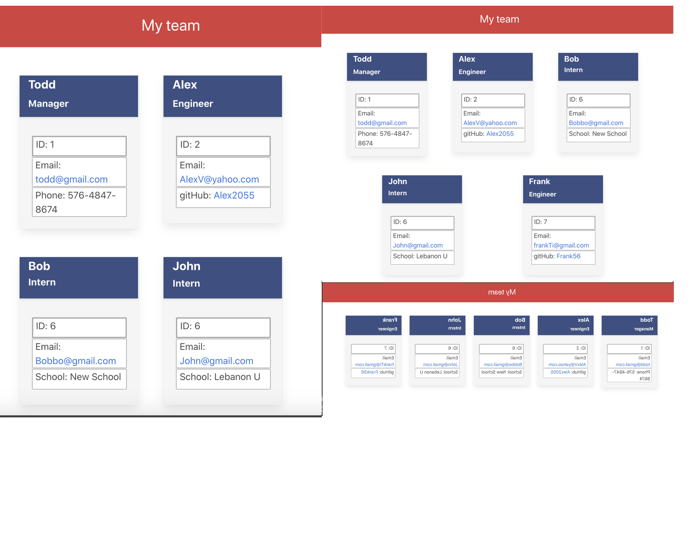

# Team Profile Generator
    
1. [ Description. ](#desc)
2. [ Installation. ](#instal)
3. [ Usage. ](#use)
4. [ Buiilt with.](#contr)
5. [ Tests.](#test)
6. [ Questions.](#ques)
7. [ Screenshot.](#scrsh)

## Description:
### Node.js command-line application that takes in information about employees on a software engineering team and generates an HTML webpage that displays summaries for each person.

## Installation:
### Run index.js

## Usage:
### Answer prompt questions then open generated index.html 

## Built with:
### Node.js javascript, html, css, jest

## Tests:
### Npm run test

## Questions:
### My gitHub profile:
## https://github.com/Alex2055
### Email me:
## alexfromnashville@gmail.com
 
 
 #
 
